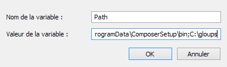

# Gloups v6.3 / Extras

[![MIT license][license-badge]][license-link]

## PULSE
Let's suppose that you already have a project with all kind of file gloups can handle and you configured config.mzg.json files in them. You probably want every single file to be analysed by gloups without opening any of them ... Saving time is saving energy when it comes to dev!

Since the v6.3 release, Gloups comes with its ultimate service named <b>Pulse</b> ! That Pulse thing works like a living being's heart ... Once a pulse, blood is spread throughout the body.

Pulse command works like serve command. By adapting the previous command, pulse could be run like this :
    
     $ gulp pulse --sass --less --stylus --mincss --ts --coffeescript --minjs --transitive

Shorter (with --all option) :

    $ gulp pulse -a -tr

The only difference with serve command is that <b>pulse</b> serves in one go instead of watching infinitely project folder as <serve> command does.

## PULSE FURTHER EXPLANATION
So when the task pulse is run, 

1. Services requested by the task arguments are activated as if you've had run ```$gulp serve --option(s)``` command.

2. All files Gloups is capable to transform or generate files from are listed.

3. Every listed file is changed by just opening it then imediately write in the same source folder without changing anything. That little snippet do the trick:
    ```
    gulp.src(e)
        .pipe(gulp.dest(function(file) {
			return file.base;
		}));
    ```
4. Gloups detect the changes and apply all transformations.

5. the process wait for last changed files then quit.
## ALIASES
Use aliases, it can improve your workflow a lot ! Possible aliases list can be found in the help. Use the command ```$ gulp helpMe``` or follow this [link to help.md](HELP.md) file.

## RUN GLOUPS FROM ANY DIRECTORY !
To use ```$ gloups``` command anywhere instead of ```$ gulp``` only in the gloups folder

### WINDOWS
add the path to gloups folder to global/environment variables like so
    


### UNIX
Comming soon

## LICENSE
[MIT][license-link] © [ManuUseGitHub (Jean Luc Emmanuel VERHANNEMAN)](https://www.linkedin.com/in/jean-luc-emmanuel-verhanneman-5a9381ab/)

[uglify-badge]: images/js-gulp--uglify-f9ea85.svg
[uglify-link]: https://www.npmjs.com/package/gulp-uglify

[typescript-badge]: https://img.shields.io/badge/ts-gulp--typescript-152740.svg?style=flat-square
[typescript-link]: https://www.npmjs.com/package/gulp-typescript

[coffee-badge]: https://img.shields.io/badge/coffee-gulp--coffee-3e2723.svg?style=flat-square
[coffee-link]: https://www.npmjs.com/package/gulp-coffee

[less-badge]: https://img.shields.io/badge/less-gulp--less-1d365d.svg?style=flat-square
[less-link]: https://www.npmjs.com/package/gulp-less

[stylus-badge]: https://img.shields.io/badge/stylus-gulp--stylus-ff6347.svg?style=flat-square
[stylus-link]: https://www.npmjs.com/package/gulp-stylus

[sass-badge]: https://img.shields.io/badge/sass-gulp--sass-c6538c.svg?style=flat-square
[sass-link]: https://www.npmjs.com/package/gulp-sass

[cleanCSS-badge]: https://img.shields.io/badge/css-gulp--clean--css-17cfa3.svg?style=flat-square
[cleanCSS-link]: https://www.npmjs.com/package/gulp-clean-css

[license-badge]: http://img.shields.io/badge/license-MIT-blue.svg?style=flat-square
[license-link]: LICENSE
