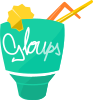

# Gloups
|License|JS|CSS|
| :---: | :---: | :---: |
|[![MIT license][license-badge]][license-link]|[![uglify service][uglify-badge]][uglify-link] [![typescript service][typescript-badge]][typescript-link] [![coffeescript service][coffee-badge]][coffee-link]|[![less service][less-badge]][less-link] [![sass service][sass-badge]][sass-link] [![clean css service][cleanCSS-badge]][cleanCSS-link]|

## A Gulp implementation once and for all
That ecosystem provides services like compression of scripts (CSS and JS) , compilation of scripts (LESS, SASS, TS and JS) and more ... on the fly globaly from a root path like C:\ or Home folder. Say no more implementation of gulp localy for every project use juste one, use this one.

### in other words
The purpose is to ovoid installing gulp in every project and repeat dozen of time the same code for the same purpose in every project. Just configure MazeGulp and a file local to the project and you're done.

## Installation

1. Download the MazeGulp project or clone it.
    
    ```
    $ git clone https://github.com/ManuUseGitHub/MazeGulp.git 
    ```


2. If MazeGulp is Your first Tool using Node installed, make sure node is installed.
    
    ```
    $ node --version
    ```


3. If you encounter an error saying the following "'node' is not recognized as an internal or an external command", make node available by adding the path to it in the Environnement Path. 
    
    [stackoverflow &bull; answer-28821955](https://stackoverflow.com/questions/23412938/node-is-not-recognized-as-an-internal-or-an-external-command-operable-program#answer-28821955)


4.  Then run

    $ npm install

5.  If you havent installed gulp before do it with

    $ npm install -g gulp --save-dev

## Setup

1. Configure the projects mapping file *(custom/config.ini)*.  

    The example template within the exemple section should gide you to setup MazeGulp accordingly to your projects.
    A project's definition should match the following syntax 
    
    ```
    [
        ProjectNameDisplayedInMazeGulp,
        "root/path/folder/for/project/relative/to/MazeGulp",
        *
    ],

    ```

    The star "\*" at last index means (check that project). To avoid checking a project, just let the value blank and keep the coma "," symbole.

2.  Scan projects

        $ gulp scanProjects 

    The effect of that command is to create config.mzg.ini files at the project root folder you specified in the custom/config.ini file via the project path you gave.

    > config.mzg.ini file is not blank and has like the custom/config.ini file a exemple template in the exemple section.
    > In those files, uncomment what services you want to enable.

    To check what service is enabled for what project run
    
    ```
    $ gulp serviceMapping    
    ```
    
## Usage
Once everything is set run gulp options you want. The simplest way is to run all services via the preset --all.

```
$ gulp --all
```

Want to know which possibilities? Refer to the help.md file or run 

```
$ gulp helpMe
``` 

(which will display help.md content) to know about what service is available and presets as well.

## License
[MIT][license-link] © [ManuUseGitHub (Jean Luc Emmanuel VERHANNEMAN)](https://www.linkedin.com/in/jean-luc-emmanuel-verhanneman-5a9381ab/)

[uglify-badge]: js-gulp--uglify-f9ea85.svg
[uglify-link]: https://www.npmjs.com/package/gulp-uglify

[typescript-badge]: https://img.shields.io/badge/ts-gulp--typescript-152740.svg?style=flat-square
[typescript-link]: https://www.npmjs.com/package/gulp-typescript

[coffee-badge]: https://img.shields.io/badge/coffee-gulp--coffee-3e2723.svg?style=flat-square
[coffee-link]: https://www.npmjs.com/package/gulp-coffee

[less-badge]: https://img.shields.io/badge/less-gulp--less-1d365d.svg?style=flat-square
[less-link]: https://www.npmjs.com/package/gulp-less

[sass-badge]: https://img.shields.io/badge/sass-gulp--sass-c6538c.svg?style=flat-square
[sass-link]: https://www.npmjs.com/package/gulp-sass

[cleanCSS-badge]: https://img.shields.io/badge/css-gulp--clean--css-17cfa3.svg?style=flat-square
[cleanCSS-link]: https://www.npmjs.com/package/gulp-clean-css

[license-badge]: http://img.shields.io/badge/license-MIT-blue.svg?style=flat-square
[license-link]: LICENSE
