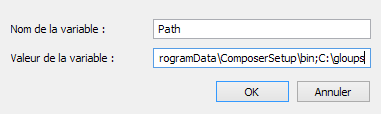

# Gloups V6.0
License

[![MIT license][license-badge]][license-link]

Main modules

[![uglify service][uglify-badge]][uglify-link] [![typescript service][typescript-badge]][typescript-link] [![coffeescript service][coffee-badge]][coffee-link] [![less service][less-badge]][less-link] [![sass service][sass-badge]][sass-link] [![clean css service][cleanCSS-badge]][cleanCSS-link]

## A Gulp implementation once and for all
Gloups is a tool that uses the gulp ecosystem and provides services like compression of scripts (<b>CSS</b> and <b>JS</b>), compilation/processing <b>LESS</b>, <b>SASS</b>, <b>TS</b>, <b>JS</b>, <b>CoffeeScript</b>. The difference between Gloups and simply using gulp is that Gloups is set globally from a root path like C:\ folder on Windows systems or Home folder on Unix systems once and watches for multiple projects.

### Purpose
The purpose is to avoid installing gulp in every project and reprogramming it dozens of time the same way for the same purposes. 

With Gloups, Just configure file paths to the root folder of your projects, a config file generated by Gloups local to them and you're done.

## End user installation

1. Download the Gloups project or clone it :
    
    ```
    $ git clone https://github.com/ManuUseGitHub/gloups.git 
    ```
    
    Extract the 'dist' folder, copy it where you want and open a terminal in it.

2.  Run :
    
    ```
    $ npm install
    ```

3.  Gloups use the gulp task runner so make sure it is installed :
    
    ```
    $ npm install -g gulp
    ```
    

## Setup

1. Configure the projects mapping file (custom/config.json) :

    Follow instructions and examples to configure properly Gloups

2. Scan projects :
    
    ```
    $ gulp scanProjects 
    ```
    
    The effect of that command is to create a <b>config.mzg.json</b> file in project root folders you specified in the custom/config.json file.

    > config.mzg.json files are not blank and have instructions.
    > In these files, uncomment what services you want to enable.
    > Enable sourcemapping for services you want by switching sourcemaps fields to true

3. To check what service is enabled for what project run :
    
    ```
    $ gulp serviceMapping    
    ```

## Usage
Once everything is set run gulp task 'serve' with options you want. The simplest way is to run all services via the preset --all with the transitive option :

    $ gulp serve --sass --less --stylus --mincss --ts --coffescript --minjs --transitive
    
shorter :

    $ gulp serve -a -tr
    
For every possibilities, refer to the help.md file or run  ```$ gulp helpMe```. Some of them can make the experiance better such as the <b>essential</b> option if Gloups is too much verbose for you :

    $ gulp serve ... --essential

## Run Gloups from any directory !
To use ```$ gloups ...``` command anywhere instead of ```$ gulp ...``` only in the gloups folder

### WINDOWS
add the path to gloups folder to global/environment variables like so
    


### UNIX
Comming soon

## License
[MIT][license-link] © [ManuUseGitHub (Jean Luc Emmanuel VERHANNEMAN)](https://www.linkedin.com/in/jean-luc-emmanuel-verhanneman-5a9381ab/)

[uglify-badge]: images/js-gulp--uglify-f9ea85.svg
[uglify-link]: https://www.npmjs.com/package/gulp-uglify

[typescript-badge]: https://img.shields.io/badge/ts-gulp--typescript-152740.svg?style=flat-square
[typescript-link]: https://www.npmjs.com/package/gulp-typescript

[coffee-badge]: https://img.shields.io/badge/coffee-gulp--coffee-3e2723.svg?style=flat-square
[coffee-link]: https://www.npmjs.com/package/gulp-coffee

[less-badge]: https://img.shields.io/badge/less-gulp--less-1d365d.svg?style=flat-square
[less-link]: https://www.npmjs.com/package/gulp-less

[sass-badge]: https://img.shields.io/badge/sass-gulp--sass-c6538c.svg?style=flat-square
[sass-link]: https://www.npmjs.com/package/gulp-sass

[cleanCSS-badge]: https://img.shields.io/badge/css-gulp--clean--css-17cfa3.svg?style=flat-square
[cleanCSS-link]: https://www.npmjs.com/package/gulp-clean-css

[license-badge]: http://img.shields.io/badge/license-MIT-blue.svg?style=flat-square
[license-link]: LICENSE

[stackoverflow-icon]: images/so-icon.svg
[stackoverflow-link]: https://stackoverflow.com
